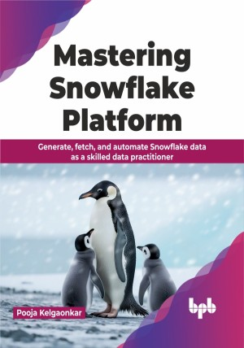

# Mastering Snowflake Platform

Embark on the data journey with the ultimate guide to Snowflake mastery

This is the repository for [Mastering Snowflake Platform
](https://bpbonline.com/products/mastering-snowflake-platform?variant=43127795679432),published by BPB Publications.

## About the Book
Handling ever evolving data for business needs can get complex. Traditional methods create bulky and costly-to-maintain data systems. Here, Snowflake emerges as a cost-effective solution, catering to both traditional and modern data needs with zero or minimal maintenance costs.

This book helps you grasp Snowflake, guiding you to create complete solutions from start to finish. The starting focus covers Snowflake architecture, key features, native loading and unloading capabilities, ANSI SQL support, and processing of diverse data types and objects. The next part utilizes acquired knowledge to look into implementing data security, governance, and collaborations, utilizing Snowflake's features like data sharing and cloning.

The final part explores advanced topics, including streams, tasks, performance optimizations, cost efficiencies, and operationalization with automated monitoring. Real-time use cases and reference architectures are provided to assist readers in implementing data warehouse, data lake, and data mesh solutions with Snowflake. 

## What You Will Learn
• Introduction to Snowflake and its three-layered architecture.

• Understand Snowflake’s native features. 

• Understand the different types of data workloads and their architecture designs.

• Implement query and cost performance optimization using Snowflake native services.

• Introduction to Snowflake’s advanced features like dynamic and event tables.

• Snowflake’s capabilities with extended support to implement large language models.
